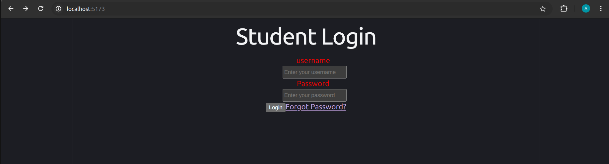

This is a student-portal App

This contains my react directory to start the app
do cd my-react-app and then npm run dev to run in your local machine

It consists of a login page,dashboard,settings,profile

profile consists of name and mailid

dashboard consists of courses grades attendace

 Currently due to lack of time no db is connected and values are hard coded will be changed in upcomming time

For the username password hard coded values

|Username|Password|
|--------|--------|
|Ram     |01      |
|krishna |02      |

# React + Vite

This template provides a minimal setup to get React working in Vite with HMR and some ESLint rules.

Currently, two official plugins are available:

- [@vitejs/plugin-react](https://github.com/vitejs/vite-plugin-react/blob/main/packages/plugin-react) uses [Oxc](https://oxc.rs)
- [@vitejs/plugin-react-swc](https://github.com/vitejs/vite-plugin-react/blob/main/packages/plugin-react-swc) uses [SWC](https://swc.rs/)

## React Compiler

The React Compiler is not enabled on this template because of its impact on dev & build performances. To add it, see [this documentation](https://react.dev/learn/react-compiler/installation).

## Expanding the ESLint configuration

If you are developing a production application, we recommend using TypeScript with type-aware lint rules enabled. Check out the [TS template](https://github.com/vitejs/vite/tree/main/packages/create-vite/template-react-ts) for information on how to integrate TypeScript and [`typescript-eslint`](https://typescript-eslint.io) in your project.
